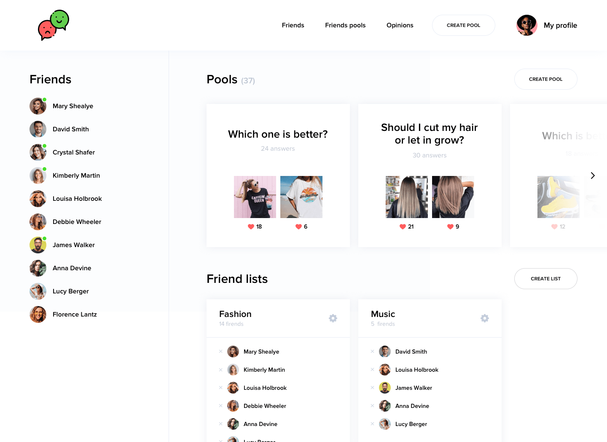

<p align="center">
  
</p>

> A social application that allows users to get instant feedback from their friends – [Demo](https://boiling-anchorage-18329.herokuapp.com/)



## Highlights

- Login / Signup with e-mail and password
- Create many friends-lists
- Search friends by name
- Upload 2 images for a poll
- Vote for friend's poll

## Table of contents

- [Features](#features)
  - [adding friend](#add-friend)
  - [check friend's profile](#check-public-profile)
  - [create a friends list](#create-a-friends-list)
  - [create a poll](#create-a-poll)
  - [vote for friend's poll](#vote-for-friends-poll)
  - [check result](#check-result)
  - [check friend's opinion](#check-friends-opinions)
- [Tech stack](#tech-stack)
- [Development Setup](#development-setup)
  - [Clone Repository](#clone-repository)
  - [Setup AWS-S3](#setup-aws-s3)
  - [Setup MongoDB Atlas](#setup-mongodb-atlas)
  - [Create .env files](#create-env-files)
  - [Run Locally](#run-locally)

## Features

### Add Friend

- At Friends Page, you can check who might be your friend.
- You can check who are your followings and followers
<!--  -->

### Check Public Profile

- When you click friend's name, you can see their public profile
- You can see their polls, if you are invited to that poll
<!--  -->

### Create A Friends List

- Create a Friends List (e.g. Fashion, Music, Random etc.)
- You need to create at least one Friends List to create a poll
<!--  -->

### Create A Poll

- Enter the question and choose a Friends List
- You can add 2 images for the poll
<!--  -->

### Vote For Friend's Poll

- If you are invited friend's polls, you can vote your opinion
<!--  -->

### Check Result

- When you click your poll, you can see the result of poll and who voted for
<!--  -->

### Check Friend's Opinions

- In the opinions page, you can see all your friend's votes
<!--  -->

## Tech Stack

- Main stack: MERN
  - [MongoDB Atlas](https://www.mongodb.com/cloud/atlas)
  - [Express.js](https://github.com/expressjs/express)
  - [React.js](https://github.com/facebook/react/)
  - [Node.js](https://nodejs.org/en/)
- [AWS SDK](https://github.com/aws/aws-sdk-js)
- [Socket.io](https://github.com/socketio/socket.io)
- [Material-UI](https://github.com/mui-org/material-ui)
- [DropZone](https://gitlab.com/meno/dropzone)

## Development Setup

### Clone Repository

```
git clone https://github.com/hatchways/team-cheerios.git
```

### Setup AWS-S3

### Setup MongoDB Atlas

- Go to [MongoDb Atlas](https://account.mongodb.com/account/login) and create an cluster
  (If you never done it before check this: [tutorial](https://docs.atlas.mongodb.com/getting-started))
- Copy the provided connection string

### Create `.env` files

check .env.example file what in the `.env` files  
[server](./server/.env.example)  
[client](./client/.env.example)

```
// for AWS-S3
AWS_ACCESS_KEY_ID=
AWS_SECRET_ACCESS_KEY=
BUCKET_NAME=

// JWT token key
jwtPrivateKey=

// MongoDB Atlas URI
ATLAS_URI=mongodb+srv://<username>:<password>@cluster.name.mongodb.net/<dbname>?retryWrites=true&w=majority
```

### Run Locally

- Server

```
cd server
cd npm install

cd npm run dev
```

- Client

```
cd client
cd npm install

cd npm run start
```
